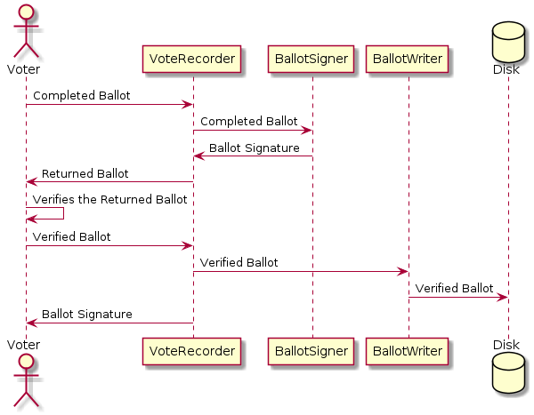
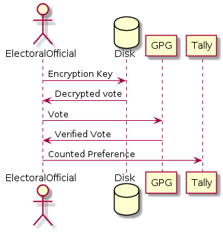

# Voter Anonymity and Integrity

## Task

You are asked to perform detailed design and modelling of the 2 requirements of your individual Task 1. The design and modelling output must include a detailed class diagram for the two requirements used for analysis and 2 sequence diagrams for the chosen requirements. You are expected to use a suitable modelling tool (e.g., LucidChart, MS Visio, or OmniGraffle). The detailed design and modelling task of the project must be formalized into a document suitable for a development team to implement.
Rubrics:

1. The sequence diagram must include actors and at least 3-4 objects and timeline of the objects. A short description must be included to describe each of the sequence diagrams.
2. The class diagram is detailed and captures all aspects of the two requirements modelled. A short description must be included to describe key aspects of the class diagram.
3. The class diagram includes correct relationships (e.g., aggregation, composition, etc.) and classes include 2-3 relevant attributes and 2-3 suitable operations.

## Chosen Requirements

**KL-R02:** Anonymity - The voter must remain anonymous and not be tied to a particular vote. Secret ballots are fundamental to democracy.

**KL-R05:** Recount - The voting system must allow for recounts should the results be disputed. A recount is an alternative system of tabulating votes. It is slower (because it is manual, simpler (usually only focuses on one seat) and therefore more accurate.

## Design

The design for these requirements fall into the vote-recording module of the application. I have designed this as a microservice as this design supports scalability - as demand increases or decreases the number of replicas can be increased or decreased accordingly. This may also be suitable to be a Serverless function.

Figure 1 shows a class diagram of the vote recording service. It follows a model/view/controller design pattern, where VoteRecorder is the view and defines the API, BallotSigner and BallotWriter are controllers and the rest are data transfer objects and models.

*Figure 1:* A class diagram for the Vote Recorder.

**VoteRecorder** defines the API and has two main methods.

*createCompletedBallot* takes a **CompletedBallot** which has been completed by the voter. It verifies that the vote is valid by calling the verification function on the Vote Counter service, transforms the ballot into a list of preferences which is then cryptographically signed and returned to the voter for verification as **ReturnedBallot**.

*commitCompletedBallot* takes a **ReturnedBallot**. By this API being called it is assumed that the **ReturnedBallot** is verified by the voter and is an accurate representation of their intention. The vote is then checked to ensure it hasn't been tampered with by verifying the signature, and then written to disk. A **BallotSignature** is returned to the client as a record of their vote, without being used to be able to determine what the vote was for. The BallotSignature must also be stored in the database for verification purposes, but not tied to a particular person or vote. The timestamp on the disk is set to a constant time so that timestamps can't be used to associate a vote with a voter. The name of the vote file should be a random string. 

Figure 2 shows a sequence diagram of the workflow for recording votes.

*Figure 2:* A sequence diagram showing the voter making their preferences, verifying them and then securely storing them for counting.

The **CompletedBallot** contains a list of **Vote** objects. A **Vote** object has a preferences (Integer) and a **Candidate** that the preference is for. The **Candidate** has the name of the candidate, ther party and whether the vote was above or below the line. If it is above the line, only the party should be defined. All of the votes should consistently be above or below the line or the vote is invalid. 

The **VerificationResult** is a result of the ballot validation. It contains a boolean whether the ballot is valid or not, and a list of Strings that give information on why the ballot is invalid if it is found to be invalid. 

The **ReturnedBallot** contains a sanitised version of the completed valid - a String of the votes in preference order, with each vote on a new line, and a cryptographic signature, **BallotSignature**, of the string. 

The **VoteCounterProxy** is a client for the VoteCounter service which is used for the ballot verification. The **BallotSigner** is used to produce the cryphtograpic signature of the ballot and **BallotWriter** is used to write the verified ballot to disk.

A program can be used to do the vote by cycling through the documents and adding up the votes. A recount can be done by manually going through all of the documents and using the public key to verify them using a third party tool such a gpg. Figure 3 shows a sequence diagram of a recount, and how the system if it is designed this way can support a manual recount. 

*Figure 3:* A sequence diagram showing a recount. 

## Design Decision

After the user votes, a text document (something that is easy to parse) is cryptographically signed using a Electoral signing key (need to keep this secure) to ensure that any modification would be detected.

The text ballot shows the ranking of the candidates that the voter has chosen. The voter verifies this list, and if it matches their preferences, this text document is placed into the encrypted ballot box. If they don’t, the ballot is destroyed and they are able to vote again. Once it is placed into the ballot box, they are marked on the electoral roll to say that they have voted. The timestamp on the ballot is manually set to a time so the time can not be used to tie the voter to a ballot. When counting, the ballots are enumerated and the private signing key used to validate them.

The user should be prevented from downloading the text document, or only able to download an encrypted form of it, to ensure that votes can’t be bought. There should be no way for anyone else to verify who they voted for. The user could keep a copy of the signature and the public key and a mechanism could be provided to check that the signature was included in the vote, without revealing who the vote was for. 

This design has the problem that the security of the system depends of the secrecy of the private key, and the system must be designed such that this key is highly protected. If it were to be taken, the election results could be changed without detection. 

The verification process will be difficult, as the vote needs to be shown to the user, without the user having the opportunity to download the vote as this could then be used to prove who the voter voted for and remove the secrecy. At the same time, the signature and the vote can’t be shown separately as then it is not possible to prove that the signature matches the vote.